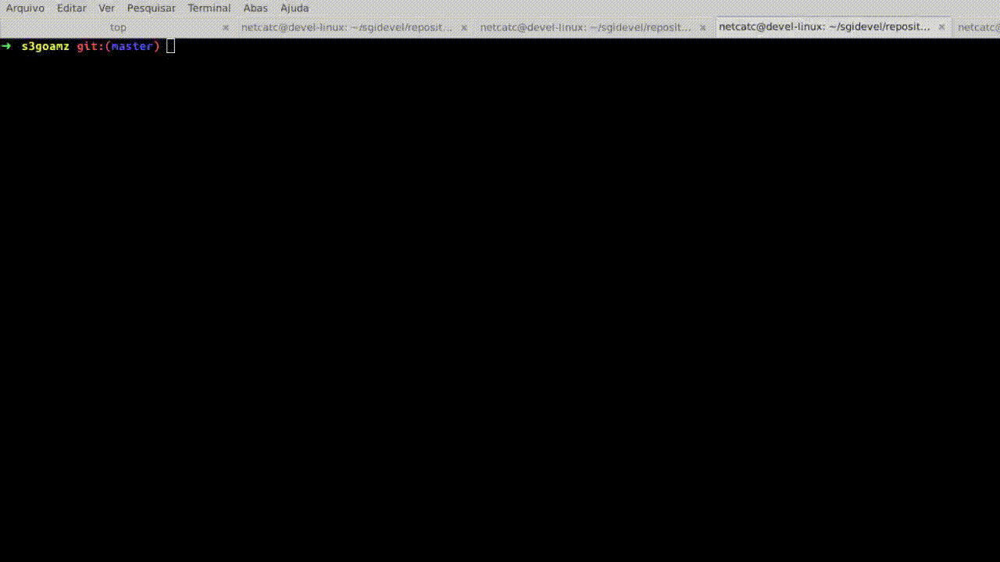

# s3goamz – Multipart Upload for Large Files on AWS S3 (Go & goamz)

This project enables reliable uploading of very large files (greater than 5GB, e.g., 10GB, 15GB, or more) to Amazon S3 using the Go language and the goamz library. Since S3 has a single-object upload limit of 5GB, we leverage the multi.PutPart method to implement S3’s native multipart upload: files are split into chunks, uploaded in parallel or sequentially, and then reassembled on the server side for efficient storage.

The implementation supports client-side encryption, allowing you to optionally encrypt file chunks before uploading, increasing data security at rest and in transit. You can choose to enable or disable encryption depending on your use case.

Authentication is handled flexibly: by default, the system reads AWS credentials securely from the standard AWS credential file (~/.aws/credentials), but also supports direct key injection (not recommended for production for security reasons). For best security practices, always store credentials on disk and never hard-code them.

This tool is ideal for anyone dealing with big data uploads to S3—handling huge backups, video archives, VM images, or data lakes—ensuring robustness, resumability, and optimal transfer performance for files that exceed standard upload limits.


# Example of operation



# Packages

go get launchpad.net/goamz/aws

go get launchpad.net/goamz/s3

go get github.com/fatih/color

got get github.com/jeffotoni/gocry

go get github.com/jeffotoni/s3goamz

# Install

$ go build s3goamz.go

$ sudo cp s3goamz /usr/bin

# help

```go
	
$ s3goamz --help

  Use: 
   s3goamz [OPTION]...
   or: s3goamz --put file.pdf --bucket name-bucket [options]
   or: s3goamz --put file.pdf --bucket name-bucket --acl read [options]
   or: s3goamz --put file.pdf --bucket name-bucket --acl read --crypt

   Put and bucket arguments are required.
   -put,     --put      <file>    The file and its respective path
   -bucket,  --bucket   <name>    Bucket name s3
   -acl,     --acl      <options> read, write, all
   -crypt,   --crypt    has no parameter
   -help,    --help     -h
   -version, --version, -v

```

# Example 1

```go

$ s3goamz --put ~/Downloads/ex2.pdf --bucket name-bucket

```

# Example 2 Encrypting file

```go

$ s3goamz -put ~/Downloads/ex2.pdf -bucket name-bucket --crypt

Will encrypt... ~/Downloads/ex2.pdf.crypt
Used key:  DKYPENJXW43SMOJCU6F5TMFVOUANMJNL

```

# Example 3

```go

$ s3goamz --version

```